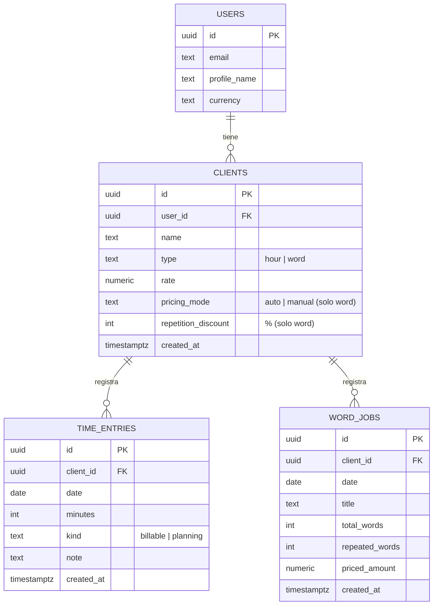
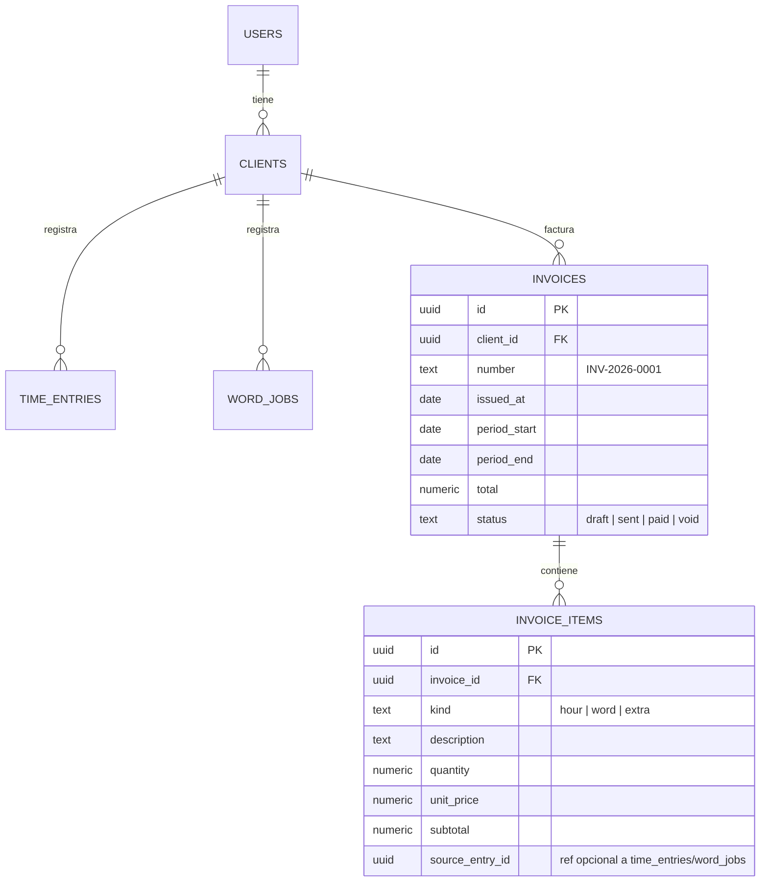

# FreelanceTrack — Modelo de datos (DER)

Modelo recomendado para cuando se migre de `localStorage` a base de datos (Lovable Cloud / Postgres).

## Modelo simple (recomendado para v1)

## Modelo con facturas (post-MVP)

Agrega historial inmutable, numeración y estados de cobro.

## Notas

- En el modelo simple no existen `invoices` / `invoice_items`. El "tarifario PDF" se calcula al vuelo desde `time_entries` + `word_jobs` filtrando por mes.
- `invoice_items` (renglones de factura) solo se necesita cuando querés congelar lo facturado (que no cambie si después editás horas) y manejar estados de cobro.
